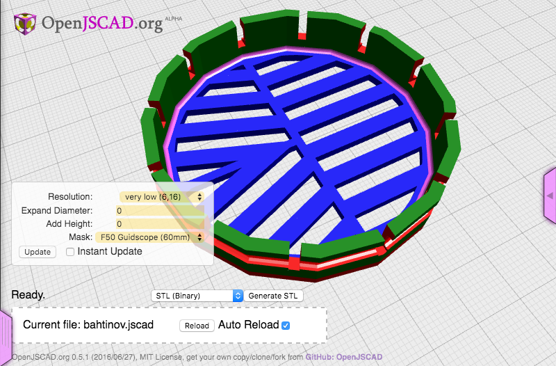

# bahtinov

> A Bahtinov mask for small scopes.



# What is a Bahtinov mask?

A [Bahtinov mask](https://en.wikipedia.org/wiki/Bahtinov_mask) is a focusing aid for astrophotography, invented by Pavel Bahtinov in 2005\. Before this, a [Hartman mask](http://www.astropix.com/HTML/I_ASTROP/FOCUS/METHODS.HTM#HM), or variations of, was often used to focus a telescope


You can get a mask for your telescope from different vendors now. This is quick and easy, but if you have multiple scopes, or have scopes that are smaller, it can be difficult to find them.

# Online Generator

[AstroJargon](http://astrojargon.net/MaskGen.aspx) has a nice Bahtinov mask generator. It will create a SVG file that you can print on card stock and cut it out.


Or you can send the SVG off to be laser cut. These are nice for large scopes.


# Small scopes

One issue for small scopes is that the slits in the mask are very small, and using a hobby knife to cut them out is difficult. Also, the narrow paper slits do not stand up well to dew.

Laser cutting has similar issues with small slits, the plastic around the slits melts and warps. Using plywood or MDF works better.

Since I have a 3D printer, I decided to print some for my guide scopes.


Now you can print them out too.

## Running

The jscad project `bahtinov` uses gulp to create a `dist/bahtinov.jscad` file and watches your source for changes. You can drag the `dist/bahtinov.jscad` directory into the drop area on [openjscad.org](http://openjscad.org). Make sure you check `Auto Reload` and any time you save, gulp will recreate the `dist/bahtinov.jscad` file and your model should refresh.

## jscad-utils

The example project uses [jscad-utils](https://www.npmjs.com/package/jscad-utils). This is a set of utilities that make object creation and alignment easier. To remove it, `npm uninstall --save jscad-utils`.

## Other libraries

You can search [NPM](https://www.npmjs.com/search?q=jscad) for other jscad libraries. Installing them with NPM then running `gulp` should create a `dist/bahtinov55.jscad` will all dependencies injected into the file.

For example, to load a RaspberryPi jscad library and show a Raspberry Pi Model B, install jscad-raspberrypi using `npm install --save jscad-raspberrypi`. Then return a combined `BPlus` group from the `main()` function.

```javascript
main()   
  util.init(CSG);

  return RaspberryPi.BPlus().combine();
}

// include:js
// endinject
```

## Publishing

If you publish the `dist/bahtinov.jscad` file, you can open it directly in

<openjscad.org> by using the following URL: <code>
  <a href="http://openjscad.org/#">http://openjscad.org/#</a>
</code> + the url to your file.</openjscad.org>

### Gist

You can save your file to a github [gist](https://gist.github.com/) and append the url to the raw gist.

For example: <http://openjscad.org/#https://gist.githubusercontent.com/johnwebbcole/43f2ef58532a204c694e5ada16888ecd/raw/d0972463f70222e6d4c6c6196a1c759bb3e2362a/snap.jscad>

### Pastebin

Or use [pastebin](http://pastebin.com/) like:

<http://openjscad.org/#http://pastebin.com/raw/9CjvuhSi>

## License

ISC © [John Cole](http://github.com/)
